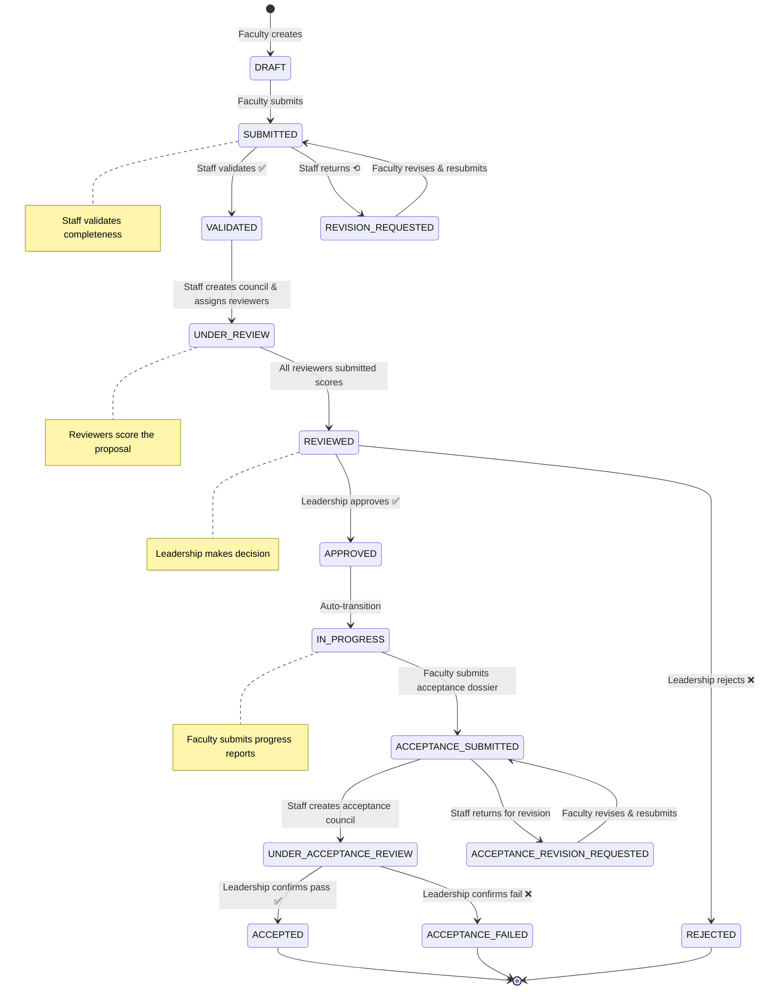
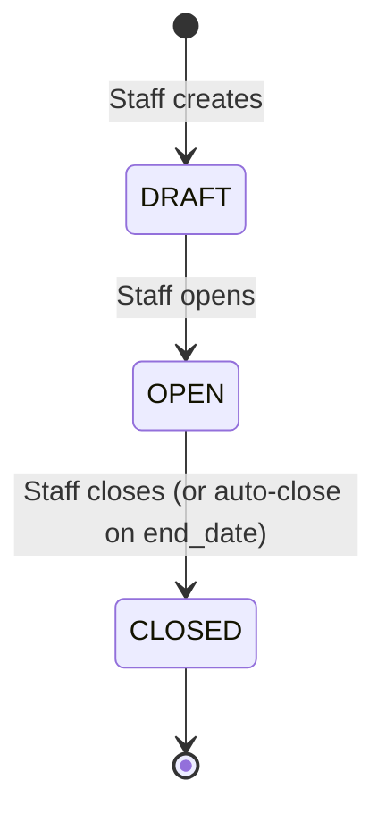
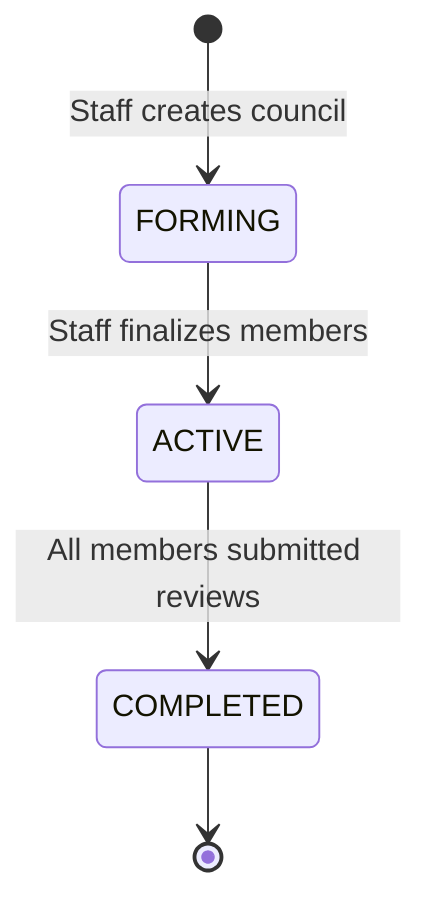

# SciRes MVP — Workflows & State Machines

> **Version:** 1.0  
> **Last Updated:** 2026-04-15  
> **Author:** Solution Architect  
> **Purpose:** Definitive reference for state transitions, business rules, and workflow implementation.

---

## 1. Core Business States

### 1.1 Proposal Status (`proposals.status`)

| Status Code | Vietnamese Label | Description | Allowed Next |
|-------------|-----------------|-------------|--------------|
| `DRAFT` | Bản nháp | Faculty is composing the proposal | `SUBMITTED`, `DELETED` |
| `SUBMITTED` | Đã nộp | Faculty submitted; waiting for Staff validation | `VALIDATED`, `REVISION_REQUESTED` |
| `REVISION_REQUESTED` | Yêu cầu chỉnh sửa | Staff found issues; returned to Faculty | `SUBMITTED` (resubmit) |
| `VALIDATED` | Đã kiểm tra | Staff confirmed completeness; ready for review | `UNDER_REVIEW` |
| `UNDER_REVIEW` | Đang phản biện | Review council is scoring | `REVIEWED` |
| `REVIEWED` | Đã phản biện | All reviewers completed; pending Leadership decision | `APPROVED`, `REJECTED` |
| `APPROVED` | Đã phê duyệt | Leadership approved the proposal | `IN_PROGRESS` |
| `REJECTED` | Từ chối | Leadership rejected the proposal | (terminal) |
| `IN_PROGRESS` | Đang thực hiện | Research is underway | `ACCEPTANCE_SUBMITTED` |
| `ACCEPTANCE_SUBMITTED` | Đã nộp nghiệm thu | Faculty submitted acceptance dossier | `UNDER_ACCEPTANCE_REVIEW` |
| `UNDER_ACCEPTANCE_REVIEW` | Đang nghiệm thu | Acceptance council is reviewing | `ACCEPTED`, `ACCEPTANCE_REVISION_REQUESTED` |
| `ACCEPTANCE_REVISION_REQUESTED` | Yêu cầu bổ sung nghiệm thu | Acceptance dossier needs revision | `ACCEPTANCE_SUBMITTED` |
| `ACCEPTED` | Nghiệm thu thành công | Project completed successfully | (terminal) |
| `ACCEPTANCE_FAILED` | Nghiệm thu không đạt | Project failed acceptance | (terminal) |

#### State Diagram — Proposal Lifecycle



---

### 1.2 Registration Period Status (`registration_periods.status`)

| Status Code | Vietnamese Label | Description | Allowed Next |
|-------------|-----------------|-------------|--------------|
| `DRAFT` | Bản nháp | Period created but not yet open | `OPEN` |
| `OPEN` | Đang mở | Accepting proposals | `CLOSED` |
| `CLOSED` | Đã đóng | No longer accepting proposals | (terminal for MVP) |



---

### 1.3 Review Council Status (`councils.status`)

| Status Code | Vietnamese Label | Description | Allowed Next |
|-------------|-----------------|-------------|--------------|
| `FORMING` | Đang thành lập | Staff is adding members | `ACTIVE` |
| `ACTIVE` | Đang hoạt động | Reviewers can submit scores | `COMPLETED` |
| `COMPLETED` | Hoàn thành | All reviews collected | (terminal) |



---

### 1.4 Review Status (`reviews.status`)

| Status Code | Vietnamese Label | Description | Allowed Next |
|-------------|-----------------|-------------|--------------|
| `PENDING` | Chờ đánh giá | Reviewer assigned but not yet scored | `SUBMITTED` |
| `SUBMITTED` | Đã đánh giá | Reviewer submitted score + comments | (terminal for MVP) |

---

### 1.5 Progress Report Status (`progress_reports.status`)

| Status Code | Vietnamese Label | Description |
|-------------|-----------------|-------------|
| `SUBMITTED` | Đã nộp | Report submitted by Faculty |

> **MVP simplification:** Progress reports are informational only — no approval cycle. Staff and Leadership view them for monitoring. Future: add `REVIEWED`, `FLAGGED` states.

---

### 1.6 Acceptance Dossier Status (`acceptance_dossiers.status`)

| Status Code | Vietnamese Label | Description | Allowed Next |
|-------------|-----------------|-------------|--------------|
| `SUBMITTED` | Đã nộp | Faculty submitted the dossier | `UNDER_REVIEW`, `REVISION_REQUESTED` |
| `REVISION_REQUESTED` | Yêu cầu bổ sung | Staff / council needs more info | `SUBMITTED` |
| `UNDER_REVIEW` | Đang đánh giá | Acceptance council is reviewing | `PASSED`, `FAILED` |
| `PASSED` | Đạt | Council recommends acceptance | (terminal) |
| `FAILED` | Không đạt | Council recommends rejection | (terminal) |

---

## 2. Detailed Workflows

### 2.1 Workflow: Đăng ký đề tài (Proposal Registration)

```
┌─────────────────────────────────────────────────────────────────┐
│ WORKFLOW: PROPOSAL REGISTRATION                                 │
├─────────────────────────────────────────────────────────────────┤
│                                                                 │
│  Actor: Faculty (Giảng viên)                                    │
│                                                                 │
│  Preconditions:                                                 │
│    - User is authenticated with FACULTY role                    │
│    - At least one registration period has status = OPEN         │
│    - Faculty has not exceeded max proposals per period (MVP: 3) │
│                                                                 │
│  Steps:                                                         │
│    1. Faculty navigates to "Tạo đề xuất đề tài"                │
│    2. System displays form with fields:                         │
│       - Tên đề tài (title) *                                   │
│       - Tóm tắt (summary) *                                    │
│       - Mục tiêu nghiên cứu (objectives) *                     │
│       - Phương pháp nghiên cứu (methodology) *                 │
│       - Kết quả dự kiến (expected_outcomes) *                   │
│       - Thời gian thực hiện (duration_months) *                 │
│       - Lĩnh vực nghiên cứu (research_field) * [dropdown]      │
│       - Đợt đăng ký (registration_period) * [dropdown, OPEN]   │
│       - Thành viên (co-investigators) [optional, multi-select]  │
│    3. Faculty fills in form                                     │
│    4. Faculty clicks "Lưu bản nháp" → status = DRAFT           │
│       OR Faculty clicks "Nộp đề xuất" → status = SUBMITTED     │
│                                                                 │
│  Postconditions:                                                │
│    - Proposal record created in database                        │
│    - If submitted: appears in Staff's "Hồ sơ chờ kiểm tra"     │
│    - Status history entry logged                                │
│                                                                 │
│  Business Rules:                                                │
│    BR-PR-1: title must be unique within the same period         │
│    BR-PR-2: period must be OPEN at time of submission           │
│    BR-PR-3: PI cannot add themselves as co-investigator         │
│    BR-PR-4: All required fields must be filled for submission   │
│    BR-PR-5: Draft can be saved with partial data                │
│    BR-PR-6: Max 3 proposals per faculty per period (MVP)        │
│                                                                 │
└─────────────────────────────────────────────────────────────────┘
```

**API Calls:**
| Step | Method | Endpoint | Body/Params |
|------|--------|----------|-------------|
| Save draft | `POST` | `/api/proposals` | `{ title, summary, ..., status: "DRAFT" }` |
| Update draft | `PUT` | `/api/proposals/{id}` | `{ title, summary, ... }` |
| Submit | `POST` | `/api/proposals/{id}/submit` | (none) |
| Load periods | `GET` | `/api/periods?status=OPEN` | |
| Load fields | `GET` | `/api/catalog/research-fields` | |
| Load faculty | `GET` | `/api/users?role=FACULTY` | |

---

### 2.2 Workflow: Kiểm tra tính hợp lệ (Dossier Validation)

```
┌─────────────────────────────────────────────────────────────────┐
│ WORKFLOW: DOSSIER VALIDATION                                    │
├─────────────────────────────────────────────────────────────────┤
│                                                                 │
│  Actor: S&T Staff (Phòng KHCN)                                 │
│                                                                 │
│  Preconditions:                                                 │
│    - Proposal has status = SUBMITTED                            │
│    - User has STAFF role                                        │
│                                                                 │
│  Steps:                                                         │
│    1. Staff navigates to "Hồ sơ chờ kiểm tra"                  │
│    2. System displays list of proposals with status=SUBMITTED   │
│    3. Staff clicks on a proposal to view detail                 │
│    4. Staff reviews all fields for completeness                 │
│    5. Decision:                                                 │
│       A) If valid:                                              │
│          - Staff clicks "Xác nhận hợp lệ"                      │
│          → status changes to VALIDATED                          │
│       B) If invalid:                                            │
│          - Staff clicks "Yêu cầu chỉnh sửa"                   │
│          - Staff enters reason (required text)                  │
│          → status changes to REVISION_REQUESTED                 │
│          → Faculty sees the proposal back in their list         │
│            with the Staff's notes                               │
│                                                                 │
│  Postconditions:                                                │
│    - If VALIDATED: proposal is ready for review council         │
│    - If REVISION_REQUESTED: Faculty must revise and resubmit   │
│    - Status history entry logged with actor + timestamp         │
│                                                                 │
│  Business Rules:                                                │
│    BR-VL-1: Only SUBMITTED proposals can be validated           │
│    BR-VL-2: Revision request must include a reason              │
│    BR-VL-3: Staff cannot validate their own proposal            │
│             (edge case: Staff who is also Faculty)              │
│                                                                 │
└─────────────────────────────────────────────────────────────────┘
```

**API Calls:**
| Step | Method | Endpoint | Body |
|------|--------|----------|------|
| List pending | `GET` | `/api/proposals?status=SUBMITTED` | |
| Get detail | `GET` | `/api/proposals/{id}` | |
| Validate | `POST` | `/api/proposals/{id}/validate` | `{ action: "APPROVE" }` |
| Return | `POST` | `/api/proposals/{id}/validate` | `{ action: "RETURN", reason: "..." }` |

---

### 2.3 Workflow: Duyệt đa cấp (Multi-Level Review & Approval)

```
┌─────────────────────────────────────────────────────────────────┐
│ WORKFLOW: MULTI-LEVEL REVIEW & APPROVAL                         │
├─────────────────────────────────────────────────────────────────┤
│                                                                 │
│  Phase 1: Council Formation (Actor: Staff)                      │
│  ──────────────────────────────────────────                     │
│    Precondition: Proposal status = VALIDATED                    │
│                                                                 │
│    1. Staff navigates to "Quản lý hội đồng"                    │
│    2. Staff creates a review council for the proposal:          │
│       - Council name (e.g., "HĐ phản biện - [Proposal title]") │
│       - Council type = "PROPOSAL_REVIEW"                        │
│    3. Staff assigns reviewers (min 2, max 5 for MVP):           │
│       - Each reviewer is a user with REVIEWER role              │
│       - A reviewer must NOT be the PI or co-investigator        │
│    4. Staff finalizes the council:                              │
│       - Council status: FORMING → ACTIVE                        │
│       - Proposal status: VALIDATED → UNDER_REVIEW               │
│       - Review records created with status = PENDING            │
│                                                                 │
│  Phase 2: Reviewer Scoring (Actor: Reviewer)                    │
│  ──────────────────────────────────────────                     │
│    Precondition: Council status = ACTIVE, Review status = PENDING│
│                                                                 │
│    5. Reviewer sees the proposal in "Hồ sơ được phân công"     │
│    6. Reviewer reads the full proposal                          │
│    7. Reviewer submits their review:                            │
│       - Score: 0-100 (integer)                                  │
│       - Verdict: PASS / FAIL / NEEDS_REVISION                  │
│       - Comments: text (required, min 50 chars)                 │
│    8. Review status: PENDING → SUBMITTED                        │
│    9. When ALL reviewers have submitted:                        │
│       - Council status: ACTIVE → COMPLETED                      │
│       - Proposal status: UNDER_REVIEW → REVIEWED                │
│       - System calculates average score                         │
│                                                                 │
│  Phase 3: Leadership Decision (Actor: Leadership)               │
│  ──────────────────────────────────────────────                 │
│    Precondition: Proposal status = REVIEWED                     │
│                                                                 │
│    10. Leadership sees proposal in "Chờ phê duyệt"             │
│    11. Leadership reviews:                                      │
│        - Proposal details                                       │
│        - All reviewer scores + comments                         │
│        - Average score                                          │
│    12. Leadership makes decision:                               │
│        A) Approve → status: APPROVED → auto-transition to       │
│                     IN_PROGRESS                                 │
│        B) Reject → status: REJECTED (with reason)               │
│                                                                 │
│  Business Rules:                                                │
│    BR-RV-1: Min 2 reviewers per council                         │
│    BR-RV-2: Reviewer cannot review own proposal                 │
│    BR-RV-3: Score must be 0-100 integer                         │
│    BR-RV-4: Comments minimum 50 characters                      │
│    BR-RV-5: All reviewers must submit before → REVIEWED         │
│    BR-RV-6: Leadership sees average score for reference          │
│             but decision is independent                         │
│    BR-RV-7: Rejection requires a reason (min 20 chars)          │
│                                                                 │
└─────────────────────────────────────────────────────────────────┘
```

**State transition summary for this workflow:**

```
Proposal:  VALIDATED → UNDER_REVIEW → REVIEWED → APPROVED/REJECTED
Council:   FORMING → ACTIVE → COMPLETED
Reviews:   PENDING → SUBMITTED
```

**API Calls:**
| Step | Method | Endpoint | Body |
|------|--------|----------|------|
| Create council | `POST` | `/api/councils` | `{ name, type: "PROPOSAL_REVIEW", proposal_id }` |
| Add member | `POST` | `/api/councils/{id}/members` | `{ user_id, role_in_council: "REVIEWER" }` |
| Activate council | `POST` | `/api/councils/{id}/activate` | |
| Get assigned | `GET` | `/api/councils/my-reviews` | |
| Submit review | `POST` | `/api/councils/{id}/reviews` | `{ score, verdict, comments }` |
| Get pending approvals | `GET` | `/api/approvals/pending` | |
| Make decision | `POST` | `/api/approvals` | `{ proposal_id, decision: "APPROVED"/"REJECTED", reason }` |

---

### 2.4 Workflow: Báo cáo tiến độ (Progress Reporting)

```
┌─────────────────────────────────────────────────────────────────┐
│ WORKFLOW: PROGRESS REPORTING                                    │
├─────────────────────────────────────────────────────────────────┤
│                                                                 │
│  Actor: Faculty (PI only)                                       │
│                                                                 │
│  Preconditions:                                                 │
│    - Proposal status = IN_PROGRESS                              │
│    - User is PI of the proposal                                 │
│                                                                 │
│  Steps:                                                         │
│    1. Faculty navigates to "Báo cáo tiến độ"                   │
│    2. Faculty selects an active proposal                        │
│    3. System shows previous reports (if any) and form:          │
│       - Kỳ báo cáo (report_order): auto-incremented            │
│       - Nội dung thực hiện (content) * [rich text]              │
│       - Tiến độ hoàn thành (completion_percentage) * [0-100%]   │
│       - Khó khăn / vướng mắc (issues) [text]                   │
│       - Kế hoạch tiếp theo (next_steps) * [text]               │
│    4. Faculty submits the progress report                       │
│    5. Report appears in Staff/Leadership monitoring views       │
│                                                                 │
│  Postconditions:                                                │
│    - Progress report stored with timestamp                      │
│    - Staff and Leadership can view the report                   │
│                                                                 │
│  Business Rules:                                                │
│    BR-PG-1: Only PI can submit progress reports                 │
│    BR-PG-2: Only for proposals with status IN_PROGRESS          │
│    BR-PG-3: completion_percentage must be >= previous report's  │
│             (monotonically increasing)                          │
│    BR-PG-4: report_order auto-increments (1, 2, 3, ...)        │
│    BR-PG-5: MVP has no approval cycle for progress reports      │
│                                                                 │
│  Monitoring (Staff/Leadership):                                 │
│    - View all proposals' latest progress                        │
│    - Filter by department, field, completion %                  │
│    - Flag proposals with low/stalled progress (visual only)     │
│                                                                 │
└─────────────────────────────────────────────────────────────────┘
```

**API Calls:**
| Step | Method | Endpoint | Body |
|------|--------|----------|------|
| List own proposals (active) | `GET` | `/api/proposals?status=IN_PROGRESS&mine=true` | |
| Get previous reports | `GET` | `/api/progress/proposals/{proposal_id}` | |
| Submit report | `POST` | `/api/progress/proposals/{proposal_id}` | `{ content, completion_percentage, issues, next_steps }` |
| Staff: list all progress | `GET` | `/api/progress?page=1&size=20` | |

---

### 2.5 Workflow: Nghiệm thu (Acceptance / Defense)

```
┌─────────────────────────────────────────────────────────────────┐
│ WORKFLOW: ACCEPTANCE (NGHIỆM THU)                               │
├─────────────────────────────────────────────────────────────────┤
│                                                                 │
│  Phase 1: Dossier Submission (Actor: Faculty)                   │
│  ────────────────────────────────────────────                   │
│    Precondition: Proposal status = IN_PROGRESS                  │
│                                                                 │
│    1. Faculty navigates to "Hồ sơ nghiệm thu"                  │
│    2. Faculty fills in acceptance dossier:                       │
│       - Báo cáo tổng kết (final_report) * [rich text]          │
│       - Kết quả đạt được (achievements) * [text]               │
│       - Công bố khoa học (publications) [text, optional]        │
│    3. Faculty submits → dossier status = SUBMITTED              │
│    4. Proposal status: IN_PROGRESS → ACCEPTANCE_SUBMITTED       │
│                                                                 │
│  Phase 2: Staff Validation (Actor: Staff)                       │
│  ────────────────────────────────────────                       │
│    Precondition: Dossier status = SUBMITTED                     │
│                                                                 │
│    5. Staff reviews the dossier for completeness                │
│    6. Decision:                                                 │
│       A) Valid → create acceptance council (Phase 3)             │
│       B) Invalid → dossier status = REVISION_REQUESTED          │
│          → Proposal status stays ACCEPTANCE_SUBMITTED            │
│          → Faculty revises and resubmits                        │
│                                                                 │
│  Phase 3: Acceptance Council (Actor: Staff + Reviewer)          │
│  ──────────────────────────────────────────────                 │
│    7. Staff creates acceptance council:                         │
│       - Council type = "ACCEPTANCE"                              │
│       - Assigns reviewers (min 2)                               │
│    8. Council activated:                                         │
│       - Dossier status: SUBMITTED → UNDER_REVIEW                │
│       - Proposal status: ACCEPTANCE_SUBMITTED →                  │
│                          UNDER_ACCEPTANCE_REVIEW                │
│    9. Each reviewer submits acceptance review:                  │
│       - Score: 0-100                                            │
│       - Verdict: PASS / FAIL                                    │
│       - Comments: text (required)                               │
│    10. When all reviewers submit:                               │
│        - Council status: ACTIVE → COMPLETED                     │
│        - System calculates average score                        │
│                                                                 │
│  Phase 4: Final Confirmation (Actor: Leadership)                │
│  ──────────────────────────────────────────────                 │
│    11. Leadership reviews acceptance results                    │
│    12. Decision:                                                │
│        A) Confirm PASS:                                         │
│           - Dossier status → PASSED                             │
│           - Proposal status → ACCEPTED                          │
│        B) Confirm FAIL:                                         │
│           - Dossier status → FAILED                             │
│           - Proposal status → ACCEPTANCE_FAILED                 │
│                                                                 │
│  Business Rules:                                                │
│    BR-AC-1: Only PI can submit acceptance dossier               │
│    BR-AC-2: Only one dossier per proposal (MVP)                 │
│    BR-AC-3: Min 2 acceptance reviewers                          │
│    BR-AC-4: Same reviewer conflict rules as proposal review     │
│    BR-AC-5: Leadership decision is final (MVP, no appeal)       │
│                                                                 │
└─────────────────────────────────────────────────────────────────┘
```

**State transitions for acceptance:**

```
Dossier:   SUBMITTED → UNDER_REVIEW → PASSED/FAILED
                     → REVISION_REQUESTED → SUBMITTED (loop)
Proposal:  IN_PROGRESS → ACCEPTANCE_SUBMITTED → UNDER_ACCEPTANCE_REVIEW
                       → ACCEPTED / ACCEPTANCE_FAILED
Council:   FORMING → ACTIVE → COMPLETED
```

---

## 3. Transition Rules (Machine-Readable)

This table is the **single source of truth** for backend state machine implementation.

### 3.1 Proposal Transitions

| # | From Status | To Status | Action | Actor | Preconditions | Side Effects |
|---|------------|-----------|--------|-------|---------------|-------------|
| T1 | `DRAFT` | `SUBMITTED` | `submit` | FACULTY | All required fields filled; period is OPEN; user is PI | Log status history |
| T2 | `SUBMITTED` | `VALIDATED` | `validate_approve` | STAFF | — | Log status history |
| T3 | `SUBMITTED` | `REVISION_REQUESTED` | `validate_return` | STAFF | reason is provided (min 10 chars) | Store revision reason; log history |
| T4 | `REVISION_REQUESTED` | `SUBMITTED` | `submit` | FACULTY | Faculty addressed revision notes | Log status history |
| T5 | `VALIDATED` | `UNDER_REVIEW` | `start_review` | SYSTEM | Council created + activated with ≥2 reviewers | Auto-triggered when council activated |
| T6 | `UNDER_REVIEW` | `REVIEWED` | `complete_review` | SYSTEM | All reviews in council have status=SUBMITTED | Auto-triggered; calculate average score |
| T7 | `REVIEWED` | `APPROVED` | `approve` | LEADERSHIP | — | Create approval_decision record; auto → IN_PROGRESS |
| T8 | `REVIEWED` | `REJECTED` | `reject` | LEADERSHIP | reason provided (min 20 chars) | Create approval_decision record |
| T9 | `APPROVED` | `IN_PROGRESS` | (auto) | SYSTEM | — | Immediate auto-transition after approval |
| T10 | `IN_PROGRESS` | `ACCEPTANCE_SUBMITTED` | `submit_acceptance` | FACULTY | Acceptance dossier submitted; user is PI | Create dossier record |
| T11 | `ACCEPTANCE_SUBMITTED` | `UNDER_ACCEPTANCE_REVIEW` | `start_acceptance_review` | SYSTEM | Acceptance council activated with ≥2 reviewers | Auto-triggered |
| T12 | `ACCEPTANCE_SUBMITTED` | `ACCEPTANCE_REVISION_REQUESTED` | `return_acceptance` | STAFF | reason provided | Store reason |
| T13 | `ACCEPTANCE_REVISION_REQUESTED` | `ACCEPTANCE_SUBMITTED` | `resubmit_acceptance` | FACULTY | Dossier revised | — |
| T14 | `UNDER_ACCEPTANCE_REVIEW` | `ACCEPTED` | `confirm_accept` | LEADERSHIP | All acceptance reviews submitted | Dossier → PASSED |
| T15 | `UNDER_ACCEPTANCE_REVIEW` | `ACCEPTANCE_FAILED` | `confirm_fail` | LEADERSHIP | All acceptance reviews submitted | Dossier → FAILED |
| T16 | `DRAFT` | (deleted) | `delete` | FACULTY | User is PI | Soft delete; only DRAFT can be deleted |

### 3.2 Backend Implementation Pattern

```python
# services/proposal_service.py

PROPOSAL_TRANSITIONS = {
    "DRAFT":                        {"submit": "SUBMITTED", "delete": None},
    "SUBMITTED":                    {"validate_approve": "VALIDATED", "validate_return": "REVISION_REQUESTED"},
    "REVISION_REQUESTED":           {"submit": "SUBMITTED"},
    "VALIDATED":                    {"start_review": "UNDER_REVIEW"},
    "UNDER_REVIEW":                 {"complete_review": "REVIEWED"},
    "REVIEWED":                     {"approve": "APPROVED", "reject": "REJECTED"},
    "APPROVED":                     {},  # auto-transitions to IN_PROGRESS
    "IN_PROGRESS":                  {"submit_acceptance": "ACCEPTANCE_SUBMITTED"},
    "ACCEPTANCE_SUBMITTED":         {"start_acceptance_review": "UNDER_ACCEPTANCE_REVIEW", "return_acceptance": "ACCEPTANCE_REVISION_REQUESTED"},
    "ACCEPTANCE_REVISION_REQUESTED":{"resubmit_acceptance": "ACCEPTANCE_SUBMITTED"},
    "UNDER_ACCEPTANCE_REVIEW":      {"confirm_accept": "ACCEPTED", "confirm_fail": "ACCEPTANCE_FAILED"},
    "REJECTED":                     {},
    "ACCEPTED":                     {},
    "ACCEPTANCE_FAILED":            {},
}

TRANSITION_ACTORS = {
    "submit": ["FACULTY"],
    "delete": ["FACULTY"],
    "validate_approve": ["STAFF"],
    "validate_return": ["STAFF"],
    "start_review": ["SYSTEM"],
    "complete_review": ["SYSTEM"],
    "approve": ["LEADERSHIP"],
    "reject": ["LEADERSHIP"],
    "submit_acceptance": ["FACULTY"],
    "start_acceptance_review": ["SYSTEM"],
    "return_acceptance": ["STAFF"],
    "resubmit_acceptance": ["FACULTY"],
    "confirm_accept": ["LEADERSHIP"],
    "confirm_fail": ["LEADERSHIP"],
}

def transition_proposal(proposal, action, actor_role):
    allowed = PROPOSAL_TRANSITIONS.get(proposal.status, {})
    if action not in allowed:
        raise ValueError(f"Cannot perform '{action}' on proposal with status '{proposal.status}'")
    if actor_role not in TRANSITION_ACTORS.get(action, []):
        raise PermissionError(f"Role '{actor_role}' cannot perform '{action}'")
    new_status = allowed[action]
    proposal.status = new_status
    # Log to status_history table
    return proposal
```

---

## 4. Non-Functional Requirements (MVP)

### 4.1 Performance

| Requirement | Target | Notes |
|------------|--------|-------|
| API response time (P95) | < 500ms | For standard CRUD operations |
| Page load time | < 2s | Initial load with cached assets |
| Concurrent users | 50 | Adequate for single university |
| Database queries per request | ≤ 5 | Avoid N+1; use eager loading |
| Max proposal list page size | 50 | Paginated with offset |

### 4.2 Security

| Requirement | Implementation |
|------------|---------------|
| Authentication | JWT with 24h expiry; refresh token not in MVP |
| Password storage | bcrypt with 12 rounds |
| Authorization | Role-based; checked on every API call |
| CORS | Whitelist frontend origin only |
| SQL injection | Prevented by SQLAlchemy ORM (parameterized queries) |
| XSS | React auto-escapes; no dangerouslySetInnerHTML |
| Rate limiting | Not in MVP (future: 100 req/min per user) |
| HTTPS | Not in MVP (local dev); required for production |

### 4.3 Usability

| Requirement | Target |
|------------|--------|
| Language | Vietnamese UI labels; English code/comments |
| Responsive design | Desktop-first; tablet-friendly sidebar |
| Form validation | Client-side + server-side; Vietnamese error messages |
| Loading states | Spinner/skeleton on all async operations |
| Error handling | Toast notifications for errors; fallback error boundary |
| Navigation | Role-based sidebar; breadcrumbs on detail pages |

### 4.4 Reliability

| Requirement | Target |
|------------|--------|
| Data integrity | PostgreSQL constraints + application-level validation |
| State machine enforcement | Backend-only state transitions (frontend cannot set status directly) |
| Seed data | Reproducible via `python -m app.seed.seed_data` |
| Database migrations | Alembic; all schema changes versioned |

### 4.5 Maintainability

| Requirement | Target |
|------------|--------|
| Code structure | Layered architecture: routes → services → models |
| API documentation | Auto-generated OpenAPI (Swagger) at `/docs` |
| Type safety | Pydantic schemas for all request/response bodies |
| Test coverage | ≥ 50% for backend services (MVP target) |

---

## 5. Risks & MVP Simplifications

### 5.1 Simplifications Made for MVP

| # | Full Feature | MVP Simplification | Technical Debt |
|---|-------------|-------------------|----------------|
| S1 | Multiple roles per user | One primary role per user | Add `user_roles` junction table support in code |
| S2 | File attachments on proposals | Text-only fields | Add file storage service (S3/MinIO) |
| S3 | Email notifications | No notifications | Add notification service + email provider |
| S4 | Configurable workflow engine | Hardcoded state machine | Extract to workflow config table |
| S5 | Audit log for all actions | Status history on proposals only | Add generic audit_log table |
| S6 | Advanced search & filtering | Basic filter by status, period, department | Add full-text search (PostgreSQL tsvector) |
| S7 | Budget/financial tracking | Not included | Add budget module with separate tables |
| S8 | Publication management | Simple text field on acceptance dossier | Add publications table with DOI, journal etc. |
| S9 | IP management | Not included | Add IP module |
| S10 | Multi-university / multi-tenant | Single university | Add tenant_id to all tables |
| S11 | Refresh token + token revocation | Simple JWT with 24h expiry | Add refresh token table |
| S12 | Report scheduling/export formats | CSV export only | Add PDF generation, scheduled reports |
| S13 | Department-level approval | University-level only | Add approval_level to workflow config |
| S14 | Reviewer expertise matching | Manual assignment by Staff | Add expertise tags + matching algorithm |
| S15 | Progress report approval cycle | Informational only (no review) | Add REVIEWED/FLAGGED states |

### 5.2 Identified Risks

| # | Risk | Impact | Likelihood | Mitigation |
|---|------|--------|-----------|------------|
| R1 | Scope creep beyond MVP | High | High | Strict adherence to defined modules; defer all "nice to have" |
| R2 | Complex state machine bugs | Medium | Medium | Centralized transition table; comprehensive unit tests for all transitions |
| R3 | Role permission gaps | Medium | Medium | Use permission matrix as test checklist; test each role-endpoint combination |
| R4 | Vietnamese text encoding issues | Low | Low | UTF-8 everywhere; PostgreSQL default |
| R5 | Seed data inconsistency | Low | Medium | Idempotent seed script; run as part of CI |
| R6 | Frontend-backend contract drift | Medium | Medium | Auto-generated OpenAPI; consider codegen for frontend types |
| R7 | Performance with large proposal lists | Low | Low | Pagination from day 1; indexed queries |

### 5.3 Extension Points (Designed for Future)

The database schema and API structure are designed to accommodate these future modules without major refactoring:

```
Future Extension Points
├── Publications Module
│   ├── Add `publications` table (doi, journal, authors, proposal_id)
│   └── Extend acceptance dossier to link publications
│
├── Financial Module  
│   ├── Add `budgets` table (proposal_id, category, amount, status)
│   ├── Add `expenditures` table (budget_id, amount, receipt)
│   └── Extend dashboard with financial KPIs
│
├── IP Management
│   ├── Add `intellectual_property` table (type, registration_no, proposal_id)
│   └── Link to acceptance outcomes
│
├── Notification System
│   ├── Add `notifications` table (user_id, type, message, read_at)
│   ├── In-app notification bell
│   └── Email integration (SMTP / SendGrid)
│
├── Configurable Workflow
│   ├── Add `workflow_definitions` table
│   ├── Add `workflow_steps` table
│   └── Dynamic state machine from config
│
└── Advanced Reporting
    ├── Add `report_templates` table
    ├── PDF generation (WeasyPrint / ReportLab)
    └── Scheduled report delivery
```

---

## 6. Status Label Mapping (Frontend Reference)

For consistent Vietnamese labels across all frontend components:

```javascript
// utils/constants.js

export const PROPOSAL_STATUS_LABELS = {
  DRAFT: 'Bản nháp',
  SUBMITTED: 'Đã nộp',
  REVISION_REQUESTED: 'Yêu cầu chỉnh sửa',
  VALIDATED: 'Đã kiểm tra',
  UNDER_REVIEW: 'Đang phản biện',
  REVIEWED: 'Đã phản biện',
  APPROVED: 'Đã phê duyệt',
  REJECTED: 'Từ chối',
  IN_PROGRESS: 'Đang thực hiện',
  ACCEPTANCE_SUBMITTED: 'Đã nộp nghiệm thu',
  UNDER_ACCEPTANCE_REVIEW: 'Đang nghiệm thu',
  ACCEPTANCE_REVISION_REQUESTED: 'Yêu cầu bổ sung nghiệm thu',
  ACCEPTED: 'Nghiệm thu thành công',
  ACCEPTANCE_FAILED: 'Nghiệm thu không đạt',
};

export const PROPOSAL_STATUS_COLORS = {
  DRAFT: '#9CA3AF',              // gray
  SUBMITTED: '#3B82F6',          // blue
  REVISION_REQUESTED: '#F59E0B', // amber
  VALIDATED: '#8B5CF6',          // purple
  UNDER_REVIEW: '#6366F1',       // indigo
  REVIEWED: '#0EA5E9',           // sky
  APPROVED: '#10B981',           // emerald
  REJECTED: '#EF4444',           // red
  IN_PROGRESS: '#14B8A6',        // teal
  ACCEPTANCE_SUBMITTED: '#3B82F6',
  UNDER_ACCEPTANCE_REVIEW: '#6366F1',
  ACCEPTANCE_REVISION_REQUESTED: '#F59E0B',
  ACCEPTED: '#22C55E',           // green
  ACCEPTANCE_FAILED: '#DC2626',  // dark red
};

export const PERIOD_STATUS_LABELS = {
  DRAFT: 'Bản nháp',
  OPEN: 'Đang mở',
  CLOSED: 'Đã đóng',
};

export const COUNCIL_STATUS_LABELS = {
  FORMING: 'Đang thành lập',
  ACTIVE: 'Đang hoạt động',
  COMPLETED: 'Hoàn thành',
};

export const REVIEW_VERDICT_LABELS = {
  PASS: 'Đạt',
  FAIL: 'Không đạt',
  NEEDS_REVISION: 'Cần chỉnh sửa',
};

export const ROLE_LABELS = {
  FACULTY: 'Giảng viên',
  STAFF: 'Phòng KHCN',
  LEADERSHIP: 'Lãnh đạo',
  REVIEWER: 'Phản biện',
  ADMIN: 'Quản trị viên',
};
```

---

## 7. Validation Rules Summary (Backend)

| Entity | Field | Rule | Error Message (Vietnamese) |
|--------|-------|------|---------------------------|
| Proposal | title | Required, 10-500 chars, unique per period | "Tên đề tài là bắt buộc (10-500 ký tự)" |
| Proposal | summary | Required, 50-5000 chars | "Tóm tắt là bắt buộc (50-5000 ký tự)" |
| Proposal | objectives | Required, 50-5000 chars | "Mục tiêu nghiên cứu là bắt buộc" |
| Proposal | methodology | Required, 50-5000 chars | "Phương pháp nghiên cứu là bắt buộc" |
| Proposal | expected_outcomes | Required, 20-3000 chars | "Kết quả dự kiến là bắt buộc" |
| Proposal | duration_months | Required, 1-36 | "Thời gian thực hiện: 1-36 tháng" |
| Proposal | field_id | Required, must exist | "Lĩnh vực nghiên cứu là bắt buộc" |
| Proposal | period_id | Required, period must be OPEN | "Đợt đăng ký không hợp lệ hoặc đã đóng" |
| Review | score | Required, 0-100 integer | "Điểm đánh giá: 0-100" |
| Review | comments | Required, min 50 chars | "Nhận xét tối thiểu 50 ký tự" |
| Review | verdict | Required, enum(PASS/FAIL/NEEDS_REVISION) | "Vui lòng chọn kết luận" |
| Progress | content | Required, min 50 chars | "Nội dung báo cáo tối thiểu 50 ký tự" |
| Progress | completion_percentage | Required, 0-100, ≥ previous | "Tiến độ phải từ 0-100% và không giảm" |
| Progress | next_steps | Required, min 20 chars | "Kế hoạch tiếp theo tối thiểu 20 ký tự" |
| Acceptance | final_report | Required, min 100 chars | "Báo cáo tổng kết tối thiểu 100 ký tự" |
| Acceptance | achievements | Required, min 50 chars | "Kết quả đạt được tối thiểu 50 ký tự" |
| User | email | Required, valid email, unique | "Email không hợp lệ hoặc đã tồn tại" |
| User | full_name | Required, 2-100 chars | "Họ tên là bắt buộc (2-100 ký tự)" |
| User | password | Required, min 8 chars (create only) | "Mật khẩu tối thiểu 8 ký tự" |
